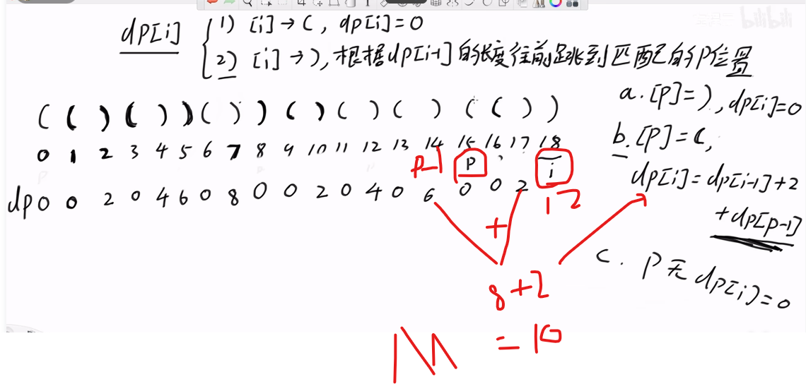

昨天粗略7小时，差不多看了5道题的不同解发，从暴力到记忆化搜索， 再到动态规划， 后面自己去写代码的时候， 我发现我的dp 思路已经差不多领略到了
不过在测试边界的时候总是出现问题， 一个是dp[n]还是dp[n+1] 这个取决于dp[0]的是否有用，并且下标要对齐后面的输入下标，比如wordbreak 139道题就是需要匹配后面substring (0,1)取字符串的左闭右开的原则，那么就多出一个n+1来超出边界n 到时候要取第n 为结尾的char, 就要用到n+1

其他的也就是正常

另外一个目前耗时多的是测试边界，这个需要非常精确在走到边界的时候，是>还是>=0 的问题， 需要把case 想清楚 这个花最长时间， 很多边界的case， 测试的时候， 发现有问题，没想清楚 查漏补缺， 耗时多

3， 就是目前代码可能还是写的少， 有写代码的写法，初始化，或者边界位置的在哪里生命for(int i=0,k=0; i<n; i++)不仅可以声明i 也可以声明k

4. 代码的优化， for or while 的使用要看condition ,for 可以明确j=0开始限制了一个边界， while需要自己写判断 这个纠结花了10几分钟