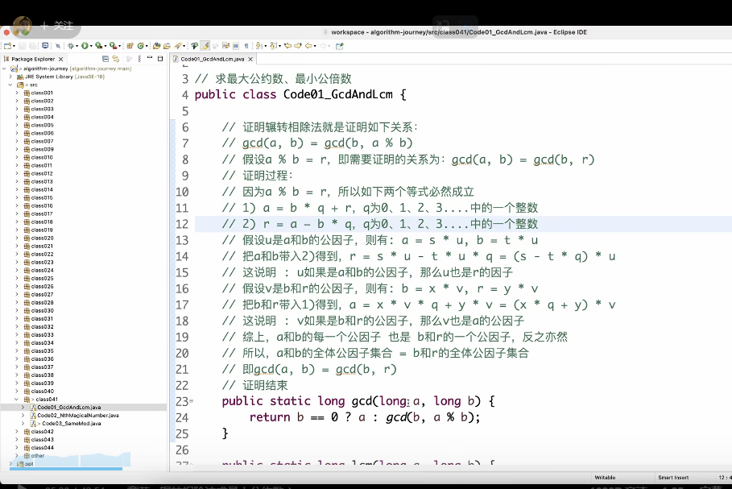
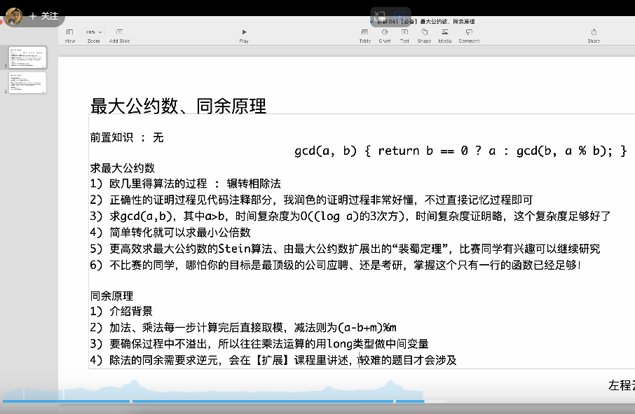

同余原理
int a 很大
int b 很大

a*b 可能超过long 的范围

要求返回的答案是 a*b=一个真实的结果 %m =?

那就说的取模的运算

对于很多计算+ - * / % 的运算，中间的结果特别大， 那么计算就会很慢， 甚至会溢出。 可能超出64位的long 的范围。

这个时候使用同余原理

比如 A+b+c+d， 每一次运算结果都会对m取模， 然后结果相加， 最后对m取模。
相当于对中间的结果取模， 然后最后结果再取模。

(a+b)%m = 中间1结果
(c+d)%m = 中间2结果
(a+b+c+d)%m = (中间1+中间2)%m =真实结果

减法不一样
(a-b)%m = (a%m+m-b%m)%m 