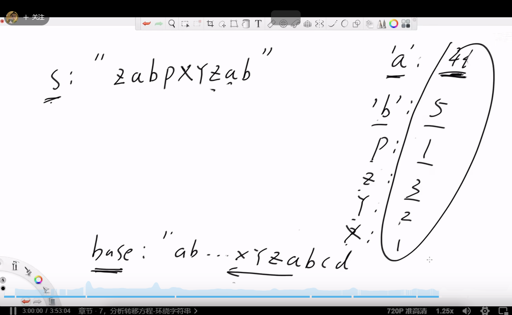
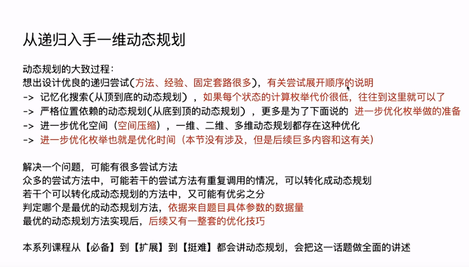

【算法讲解070【必备】子数组最大累加和问题与扩展-上-哔哩哔哩】
https://b23.tv/f0kPXcm

左程云
【算法讲解071【必备】子数组最大累加和问题与扩展-下-哔哩哔哩】
https://b23.tv/XTUhmp2

阶段一是必会基础，拿下这部分，一定具备解决大厂笔试、面试任何题目的知识。阶段二是必刷高频题目，算是增长题目见识。如果你想自己刷题，也建议先看完这些，因为很多题目都来自于必备知识的简单使用。看的时候，保证自己能独立写出来即可进行下一节内容。这些内容很多，所以你可以一周消化3节课，一直持续到你找到心仪的工作，就是一直看一直练。不需要复习，整体看完了可以统一复习

阶段一，算法和数据结构整体的学习，必须要会的基础
视频：
https://b23.tv/20ahZrz

代码：
https://github.com/algorithmzuo

阶段一从讲解001看到讲解098，如果面试顶级大厂，也只需要学到132节。b站132节之后的课不需要看，只有准备算法竞赛的同学需要看。

阶段二，大厂高频题的进一步练习，阶段一和阶段二涉及的题目，都是大厂常考的题
视频：
https://www.mashibing.com/course/465

代码：
https://github.com/algorithmzuo/coding-for-great-offer

阶段二看前40节

跟大类刷比较好，所谓的每个公司高频题是不存在的，每个公司都可能考任何题。目前我建议你每天保证题量，坚持一段时间，可以刷课上的，也可以找leetcode更多的高频题。因为只刷100-200道，其实可以认为都不算入门水平。今天找大厂，至少是500题起步的。如果你不参加笔试，那也至少300题。
08:51

左程云
忘的问题，需要你独立写出实现，做到这个。然后自己记那种极简笔记。一道题笔记包括：题目描述、核心做法、避坑提醒。三个部分保证200字以内。自己看着极简版的笔记，能回忆起题目和做法。时常翻阅。这就让复习的代价很轻。这是比较经济的对抗遗忘的方式。