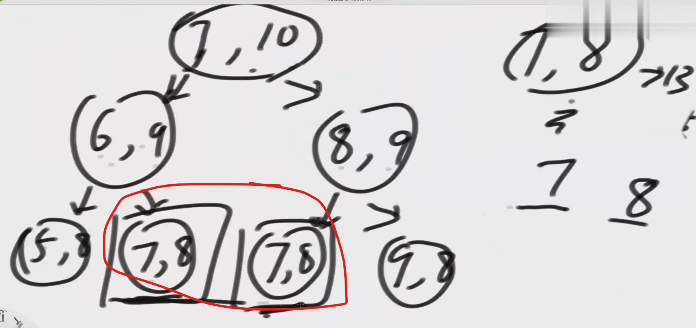

stack相关 // 递归的本质是函数调用栈
1. 递归到一个边界，什么情况不再递归，返回结果
2. 递归的过程，如何处理当前层的逻辑

master 公式 分析时间复杂度：适用子递归行为是一致的
T(n) = a*T(n/b) + O(n^d)

a: 递归调用的次数
b: 每次递归处理问题的规模
d: 非递归部分的时间复杂度
1. 如果 a < b^d, 则 T(n) = O(n^d)
2. 如果 a = b^d, 则 T(n) = O(n^d * log n)
3. 如果 a > b^d, 则 T(n) = O(n^(log_b(a)))

暴力递归->动态规划的本质是为了
空间换时间
暴力递归的优化是一般出现了重复解的

怎么优化：缓存法,记忆化搜索

// 例子：计算阶乘
function factorial(n) {
  if (n === 0) return 1; // 边界条件
  return n * factorial(n - 1); // 递归调用
}

// 例子：斐波那契数列
function fibonacci(n) {
  if (n <= 1) return n; // 边界条件
  return fibonacci(n - 1) + fibonacci(n - 2); // 递归调用
}
// 例子：二分查找
function binarySearch(arr, target, left, right) {
  if (left > right) return -1; // 边界条件
  const mid = Math.floor((left + right) / 2);
  if (arr[mid] === target) return mid; // 找到目标
  if (arr[mid] > target) {
    return binarySearch(arr, target, left, mid - 1); // 左半部分
  } else {
    return binarySearch(arr, target, mid + 1, right); // 右半部分
  }
}

// 例子：全排列
function permute(nums) {
  const result = [];
  const backtrack = (path, options) => {
    if (options.length === 0) {
      result.push(path); // 边界条件

        return;

    }
    for (let i = 0; i < options.length; i++) {
      backtrack([...path, options[i]], options.filter((_, index) => index !== i)); // 递归调用
    }
    };
    backtrack([], nums);
    return result;
    }
// 例子：汉诺塔问题
function hanoi(n, source, target, auxiliary) {
  if (n === 1) {
    console.log(`Move disk 1 from ${source} to ${target}`); // 边界条件
    return;
  }
  hanoi(n - 1, source, auxiliary, target); // 将 n-1 个盘子从 source 移到 auxiliary
  console.log(`Move disk ${n} from ${source} to ${target}`); // 将第 n 个盘子从 source 移到 target
  hanoi(n - 1, auxiliary, target, source); // 将 n-1 个盘子从 auxiliary 移到 target
}
// 例子：树的遍历
function TreeNode(val) {
  this.val = val;
  this.left = this.right = null;
}
function inorderTraversal(root) {
  const result = [];
  const traverse = (node) => {
    if (!node) return; // 边界条件
    traverse(node.left); // 递归左子树
    result.push(node.val); // 处理当前节点
    traverse(node.right); // 递归右子树
  };
  traverse(root);
  return result;
}
// 例子：图的深度优先搜索 (DFS)
function dfs(graph, start, visited = new Set()) {
  if (visited.has(start)) return; // 边界条件
  visited.add(start); // 标记节点为已访问
  console.log(start); // 处理当前节点
  for (const neighbor of graph[start]) {
    dfs(graph, neighbor, visited); // 递归访问邻居节点
  }
}
// 例子：计算数组的和
function arraySum(arr, index = 0) {
  if (index >= arr.length) return 0; // 边界条件
  return arr[index] + arraySum(arr, index + 1); // 递归调用
}
// 例子：反转字符串
function reverseString(str) {
  if (str === "") return ""; // 边界条件
  return str[str.length - 1] + reverseString(str.slice(0, -1)); // 递归调用
}
// 例子：计算幂
function power(base, exp) {
  if (exp === 0) return 1; // 边界条件
  return base * power(base, exp - 1); // 递归调用
}
// 例子：合并排序 (Merge Sort)
function mergeSort(arr) {
  if (arr.length <= 1) return arr; // 边界条件
  const mid = Math.floor(arr.length / 2);
  const left = mergeSort(arr.slice(0, mid)); // 递归左半部分
  const right = mergeSort(arr.slice(mid)); // 递归右半部分
  return merge(left, right); // 合并两个有序数组
}
function merge(left, right) {
  const result = [];
  let i = 0, j = 0;
  while (i < left.length && j < right.length) {
    if (left[i] < right[j]) {
      result.push(left[i]);
      i++;
    } else {
      result.push(right[j]);
      j++;
    }
  }
  return result.concat(left.slice(i)).concat(right.slice(j));
}
// 例子：计算最大公约数 (GCD) 使用欧几里得算法
function gcd(a, b) {
  if (b === 0) return a; // 边界条件
  return gcd(b, a % b); // 递归调用
}
// 例子：计算数组的最大值
function arrayMax(arr, index = 0) {
  if (index === arr.length - 1) return arr[index]; // 边界条件
  return Math.max(arr[index], arrayMax(arr, index + 1)); // 递归调用
}
// 例子：计算数组的最小值
function arrayMin(arr, index = 0) {
  if (index === arr.length - 1) return arr[index]; // 边界条件
  return Math.min(arr[index], arrayMin(arr, index + 1)); // 递归调用
}
// 例子：计算数组的平均值
function arrayAvg(arr, index = 0) {
  if (index === arr.length) return 0; // 边界条件
  return (arr[index] + arrayAvg(arr, index + 1) * (arr.length - index - 1)) / (arr.length - index); // 递归调用
}
// 例子：计算数组的长度
function arrayLength(arr, index = 0) {
  if (index === arr.length) return 0; // 边界条件
  return 1 + arrayLength(arr, index + 1); // 递归调用
}
// 例子：计算数组中某个元素的出现次数
function arrayCount(arr, target, index = 0) {
  if (index === arr.length) return 0; // 边界条件
  return (arr[index] === target ? 1 : 0) + arrayCount(arr, target, index + 1); // 递归调用
}
// 例子：计算数组的反转
function arrayReverse(arr, index = 0) {
  if (index >= arr.length / 2) return; // 边界条件
  [arr[index], arr[arr.length - 1 - index]] = [arr[arr.length - 1 - index], arr[index]]; // 交换元素
  arrayReverse(arr, index + 1); // 递归调用
}
// 例子：计算字符串的长度
function stringLength(str, index = 0) {
  if (index === str.length) return 0; // 边界条件
  return 1 + stringLength(str, index + 1); // 递归调用
}
// 例子：检查字符串是否是回文
function isPalindrome(str, left = 0, right = str.length - 1) {
  if (left >= right) return true; // 边界条件
  if (str[left] !== str[right]) return false; // 不匹配
  return isPalindrome(str, left + 1, right - 1); // 递归调用
}
// 例子：计算字符串中某个字符的出现次数
function charCount(str, char, index = 0) {
  if (index === str.length) return 0; // 边界条件
  return (str[index] === char ? 1 : 0) + charCount(str, char, index + 1); // 递归调用
}
// 例子：生成括号组合
function generateParenthesis(n) {
  const result = [];
  const backtrack = (path, open, close) => {
    if (path.length === n * 2) {
      result.push(path); // 边界条件
      return;
    }
    if (open < n) {
      backtrack(path + '(', open + 1, close); // 添加左括号
    }
    if (close < open) {
      backtrack(path + ')', open, close + 1); // 添加右括号
    }
  };
  backtrack('', 0, 0);
  return result;
}
// 例子：计算数组的乘积
function arrayProduct(arr, index = 0) {
  if (index === arr.length) return 1; // 边界条件
  return arr[index] * arrayProduct(arr, index + 1); // 递归调用
}
// 例子：计算数组的幂集
function powerSet(arr, index = 0) {
  if (index === arr.length) return [[]]; // 边界条件
  const subsets = powerSet(arr, index + 1); // 递归调用
  const current = arr[index];
  return subsets.concat(subsets.map(subset => [current, ...subset])); // 合并子集
}
// 例子：计算数组的所有组合
function combinations(arr, k, start = 0, path = [], result = []) {
  if (path.length === k) {
    result.push([...path]); // 边界条件
    return;
  }
  for (let i = start; i < arr.length; i++) {
    path.push(arr[i]);
    combinations(arr, k, i + 1, path, result); // 递归调用
    path.pop(); // 回溯
  }
  return result;
}
// 例子：计算数组的所有排列
function permutations(arr, path = [], result = []) {
  if (path.length === arr.length) {
    result.push([...path]); // 边界条件
    return;
  }
  for (let i = 0; i < arr.length; i++) {
    if (path.includes(arr[i])) continue; // 避免重复
    path.push(arr[i]);
    permutations(arr, path, result); // 递归调用
    path.pop(); // 回溯
  }
  return result;
}
// 例子：计算数组的所有子集
function subsets(arr, index = 0, path = [], result = []) {
  result.push([...path]); // 每个路径都是一个子集
  for (let i = index; i < arr.length; i++) {
    path.push(arr[i]);
    subsets(arr, i + 1, path, result); // 递归调用
    path.pop(); // 回溯
  }
  return result;
}
// 例子：计算数组的所有排列（包含重复元素）
function permuteUnique(arr, path = [], result = []) {
  if (path.length === arr.length) {
    result.push([...path]); // 边界条件
    return;
  }
  const used = new Set();
  for (let i = 0; i < arr.length; i++) {
    if (used.has(arr[i])) continue; // 避免重复
    used.add(arr[i]);
    path.push(arr[i]);
    const nextArr = arr.slice(0, i).concat(arr.slice(i + 1)); // 去掉当前元素
    permuteUnique(nextArr, path, result); // 递归调用
    path.pop(); // 回溯
  }
  return result;
}
// 例子：计算数组的所有组合（包含重复元素）
function combinationsWithDup(arr, k, start = 0, path = [], result = []) {
  if (path.length === k) {
    result.push([...path]); // 边界条件
    return;
  }
  for (let i = start; i < arr.length; i++) {
    if (i > start && arr[i] === arr[i - 1]) continue; // 避免重复
    path.push(arr[i]);
    combinationsWithDup(arr, k, i + 1, path, result); // 递归调用
    path.pop(); // 回溯
  }
  return result;
}
// 例子：计算数组的所有子集（包含重复元素）
function subsetsWithDup(arr, index = 0, path = [], result = []) {
  result.push([...path]); // 每个路径都是一个子集
  for (let i = index; i < arr.length; i++) {
    if (i > index && arr[i] === arr[i - 1]) continue; // 避免重复
    path.push(arr[i]);
    subsetsWithDup(arr, i + 1, path, result); // 递归调用
    path.pop(); // 回溯
  }
  return result;
}
// 例子：计算数组的所有排列（包含重复元素）
function permuteUnique(arr, path = [], result = []) {
  if (path.length === arr.length) {
    result.push([...path]); // 边界条件
    return;
  }
  const used = new Set();
  for (let i = 0; i < arr.length; i++) {
    if (used.has(arr[i])) continue; // 避免重复
    used.add(arr[i]);
    path.push(arr[i]);
    const nextArr = arr.slice(0, i).concat(arr.slice(i + 1)); // 去掉当前元素
    permuteUnique(nextArr, path, result); // 递归调用
    path.pop(); // 回溯
  }
  return result;
}
// 例子：计算数组的所有组合（包含重复元素）java code
function combinationsWithDup(arr, k, start = 0, path = [], result = []) {
  if (path.length === k) {
    result.push([...path]); // 边界条件
    return;
  }
  for (let i = start; i < arr.length; i++) {
    if (i > start && arr[i] === arr[i - 1]) continue; // 避免重复
    path.push(arr[i]);
    combinationsWithDup(arr, k, i + 1, path, result); // 递归调用
    path.pop(); // 回溯
  }
  return result;
}
// 例子：计算数组的所有子集（包含重复元素）java code 写
public static List<List<Integer>> subsetsWithDup(int[] nums) {
    List<List<Integer>> result = new ArrayList<>();
    Arrays.sort(nums); // 排序以便去重
    backtrack(nums, 0, new ArrayList<>(), result);
    return result;
}

private static void backtrack(int[] nums, int index, List<Integer> path, List<List<Integer>> result) {
    result.add(new ArrayList<>(path));
    for (int i = index; i < nums.length; i++) {
        if (i > index && nums[i] == nums[i - 1]) continue; // 跳过重复元素
        path.add(nums[i]);
        backtrack(nums, i + 1, path, result);
        path.remove(path.size() - 1);
    }
}
// 例子：计算数组的所有排列（包含重复元素）java code 写
public static List<List<Integer>> permuteUnique(int[] nums) {
    List<List<Integer>> result = new ArrayList<>();
    Arrays.sort(nums); // 排序以便去重
    boolean[] used = new boolean[nums.length];
    backtrack(nums, new ArrayList<>(), used, result);
    return result;
}
private static void backtrack(int[] nums, List<Integer> path, boolean[] used, List<List<Integer>> result) {
    if (path.size() == nums.length) {
        result.add(new ArrayList<>(path));
        return;
    }
    for (int i = 0; i < nums.length; i++) {
        if (used[i]) continue; // 已使用
        if (i > 0 && nums[i] == nums[i - 1] && !used[i - 1]) continue; // 跳过重复元素
        used[i] = true;
        path.add(nums[i]);
        backtrack(nums, path, used, result);
        used[i] = false;
        path.remove(path.size() - 1);
    }
}
// 例子：计算数组的所有组合（包含重复元素）java code 写
public static List<List<Integer>> combinationsWithDup(int[] nums, int k) {
    List<List<Integer>> result = new ArrayList<>();
    Arrays.sort(nums); // 排序以便去重
    backtrack(nums, k, 0, new ArrayList<>(), result);
    return result;
}
private static void backtrack(int[] nums, int k, int start, List<Integer> path, List<List<Integer>> result) {
    if (path.size() == k) {
        result.add(new ArrayList<>(path));
        return;
    }
    for (int i = start; i < nums.length; i++) {
        if (i > start && nums[i] == nums[i - 1]) continue; // 跳过重复元素
        path.add(nums[i]);
        backtrack(nums, k, i + 1, path, result);
        path.remove(path.size() - 1);
    }
}
// 例子：计算数组的所有子集（包含重复元素）java code 写
public static List<List<Integer>> subsetsWithDup(int[] nums) {
    List<List<Integer>> result = new ArrayList<>();
    Arrays.sort(nums); // 排序以便去重
    backtrack(nums, 0, new ArrayList<>(), result);
    return result;
}
private static void backtrack(int[] nums, int index, List<Integer> path, List<List<Integer>> result) {
    result.add(new ArrayList<>(path));
    for (int i = index; i < nums.length; i++) {
        if (i > index && nums[i] == nums[i - 1]) continue; // 跳过重复元素
        path.add(nums[i]);
        backtrack(nums, i + 1, path, result);
        path.remove(path.size() - 1);
    }
}

